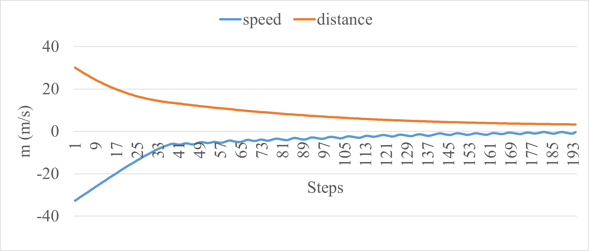
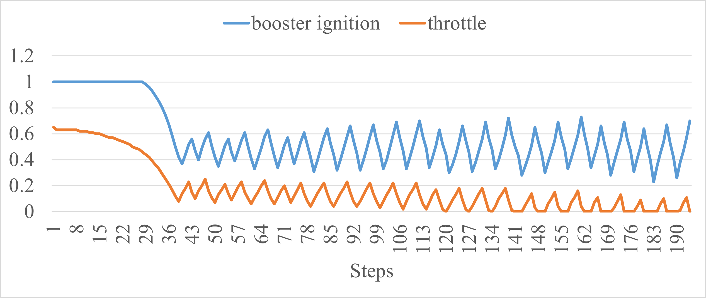

# Install dependencies
    pip install stable-baselines3 PyFlyt gymnasium tensorboard
# Overwrite the original pyflyt files for reduplication and data visualization
The two original pyflyt files `rocket_base_env.py` and `rocket_landing_env.py` in `(your_lib)\site-packages\PyFlyt\gym_envs\rocket_envs\` should be replaced with the files with the relative name in this Github.
# Vertical Landing - Reduplicate and get data via 'tensorboard'
1. Run `rocketlanding_PPO.py`
2. Watch data via `tensorboard`
3. Run `test.py` to get the video
# Design reward
* In Function `compute_term_trunc_reward` (rocket_landing_env) or Function `step` (rocket_base_env)
# Windy Landing Task
1. In `wind_test.py`, design the wind model
2. In `rocket_base_env.py`, enable `self.env.register_wind_field_function(simple_wind)`
3. Run `rocketlanding_PPO.py` or `rocketlanding_SAC.py`
4. Watch data via `tensorboard` to check if the reward works
# Horizontal Landing Task
1. In `rocket_landing_env.py`, change the rocket's start position, such as `start_pos=np.array([[5, 0.0, ceiling * 0.9]])` to let the rocket land from (5, 0, *)
2. Run `rocketlanding_PPO.py` or `rocketlanding_SAC.py`
3. Watch data via `tensorboard` to check if the reward works
# TODO list
1. - [x] vertical landing 
2. - [x] windy landing (not optimal)
3. - [x] horizontal landing (not optimal)
# Results
## Vertical Landing

